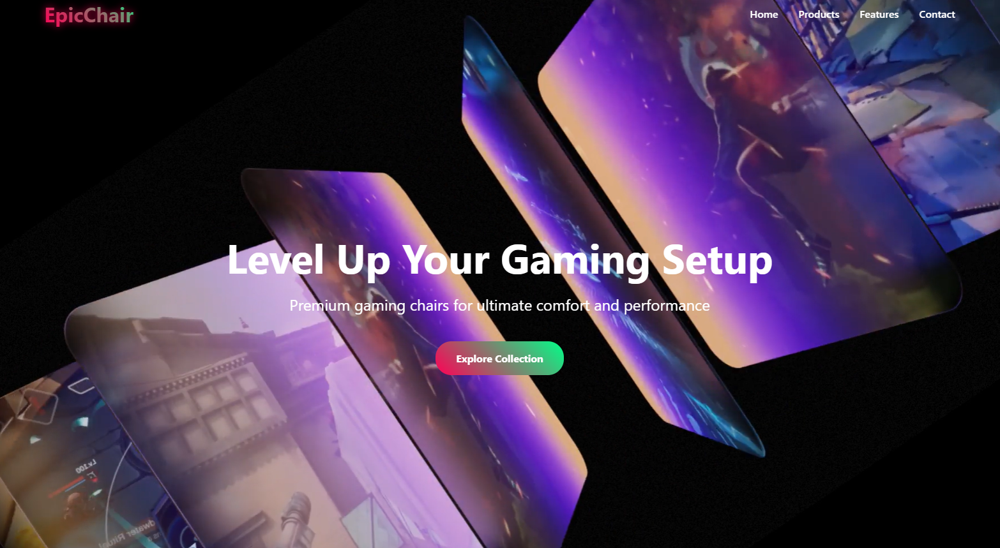

# 🎮 EpicChair Gaming Website

A modern, responsive e-commerce website for premium gaming chairs, featuring an immersive UI design and seamless user experience.

## ✨ Features

- **Immersive Hero Section:** Dynamic video background with compelling call-to-action
- **Premium Product Showcase:** Responsive grid layout featuring gaming chair collection
- **Interactive Features Section:** Highlights key selling points with animated icons
- **Contact Form Integration:** User-friendly contact system with social media integration
- **Responsive Design:** Fully adaptive layout across all device sizes
- **Modern UI Elements:** Gradient effects, animations, and hover interactions

## 🎨 Design Elements

- **Color Scheme:**
  - Primary: #ff0055
  - Secondary: #00ff88
  - Dark: #1a1a1a
  - Light: #ffffff

- **Animations:**
  - Smooth scroll behavior
  - Glow effects on logo
  - Slide-up animations
  - Hover transformations

## 🛠️ Technologies Used

- HTML5
- CSS3
- Font Awesome Icons
- JavaScript (for video autoplay)

## 📱 Responsive Features

- Adaptive navigation menu
- Flexible product grid
- Responsive contact form layout
- Mobile-optimized images and content

## 🌐 Browser Support

- Chrome
- Firefox
- Safari
- Edge
- Modern mobile browsers

## 📝 License

© 2025 EpicChair. All rights reserved.